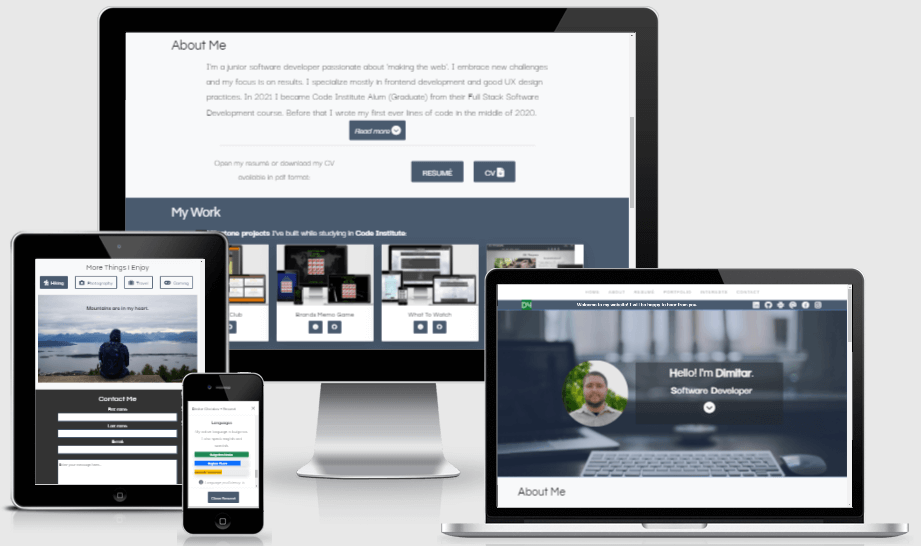

# **Dimitar Cholakov** - Personal Website/Portfolio

This is my personal website. Here you can learn more about me, my professional and personal experiences, my goals and interests, opportunity to contact or connect with me on social media.

[Live link here!](https://dimitar-4.github.io/dimitar-cholakov-website/)

---

## Languages Used

1. HTML 5
2. CSS 3
3. JavaScript

## Technologies Used

1.  Visual Studio Code
    - Code editor used to create this project.
2.  Bootstrap v5.1.3
    - Used to add responsive design, components and layout.
3.  Google Fonts
    - Used to add fonts for the text content.
4.  Font Awesome
    - Used to add icons.
5.  Favicon.io
    - Used to create favicon & website logo.
6.  Git
    - Used for version control.
7.  GitHub
    - Used to publish and store this project.
8.  Formspree
    - Used to add functionality to contact form.
9.  TinyPNG
    - Used to compress images in the project.

---

## Credits

### Media

- Background image of the hero container & gaming-tab background image in interests menu are from [Freepik](https://www.freepik.com/).
